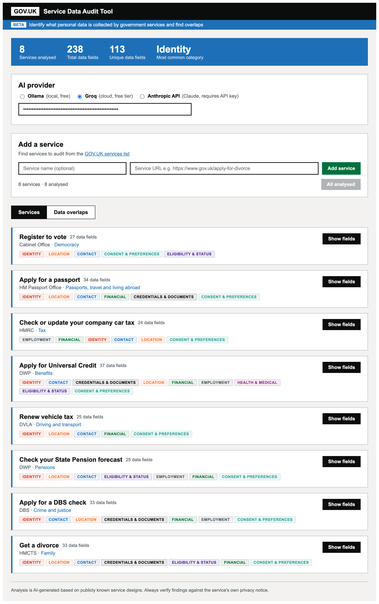

# GOV.UK Service Data Audit Tool

A tool for identifying what personal data is collected by GOV.UK services and finding overlaps across services.

It analyses each service's user journey and lists every individual data field collected (e.g. "First name", "Postcode", "Sort code") rather than broad categories. Once multiple services are analysed, a cross-service overlap view shows which data fields are collected by more than one service.

You can also try it at https://statuesque-hummingbird-b3f62b.netlify.app (requires a Groq or Anthropic API key).

## Example



## Prerequisites

- [Node.js](https://nodejs.org/) v18 or later
- One of the following AI providers:
  - **Ollama** (free, runs locally) — install from https://ollama.ai/
  - **Groq** (free tier, cloud) — get an API key at https://console.groq.com/keys
  - **Anthropic API** — sign up at https://console.anthropic.com/
  - **Computer Use** (navigates live services) — requires Anthropic API key + backend server

### Option 1: Ollama (local, free)

1. Install Ollama from https://ollama.ai/
2. Pull the model:

```bash
ollama pull gemma3:4b
```

3. Make sure Ollama is running (it starts automatically on macOS after install)

### Option 2: Groq (cloud, free tier)

No additional setup needed. Get a free API key at https://console.groq.com/keys and enter it in the app. This uses Llama 3.3 70B hosted on Groq's infrastructure.

### Option 3: Anthropic API

No additional setup needed. You'll enter your API key in the app. This uses Claude Sonnet and will produce the highest quality results.

### Option 4: Computer Use (navigates live services)

This mode uses Claude's computer use capability to actually visit each service URL in a real browser, navigate through the forms (filling in plausible test data), and catalogue every data field it encounters on screen. This produces the most accurate results because it reads the actual live service rather than relying on training knowledge.

**Requirements:**
- An Anthropic API key
- The backend server running locally

**Setup:**

```bash
cd server
npm install
npx playwright install chromium
npm start
```

The backend server starts on `http://localhost:3001`. Then select "Computer Use" as the provider in the app and enter your Anthropic API key.

**Note:** Each service takes 2-10 minutes to audit. Services requiring GOV.UK One Login or Government Gateway authentication cannot be fully navigated. Computer use involves many API calls with screenshots, so costs are higher (~$0.50-2.00 per service).

## Getting started

```bash
git clone https://github.com/gavinwye/govuk-data-analysis.git
cd govuk-data-analysis
npm install
npm run dev
```

This starts a local dev server, typically at `http://localhost:5173/`.

## How to use

1. Choose your AI provider at the top of the page (Ollama, Groq, or Anthropic API)
2. The tool comes pre-loaded with 8 sample GOV.UK services
3. Click **Analyse** on any service to identify the data it collects, or **Analyse all** to run them all
4. Click **Show fields** on an analysed service to see the full list of data fields
5. Once 2 or more services are analysed, use the **Data overlaps** tab to see which data fields are collected by multiple services

You can add additional services using the "Add a service" form. Find services to audit from the [GOV.UK services list](https://govuk-services-list.x-govuk.org/topic).

Results are saved to your browser's local storage, so they persist across page refreshes.

## How it works

### Ollama, Groq, and Anthropic API modes

The tool sends each service's name, URL, and organisation to the chosen AI model with a prompt asking it to list every data field collected by that service. The model responds based on its **training knowledge** of what the service collects — it does not visit the URL, scrape the live service, or read the service's actual privacy notice.

The prompt instructs the model to think through every page and step of the user journey and list each field at the most granular level (e.g. "First name", "Postcode", "Sort code" rather than "Name", "Address", "Bank details"). Each field is categorised, marked as required or optional, and tagged with the journey step that collects it.

When using Ollama, all analysis runs locally on your machine. When using Groq or the Anthropic API, service names and URLs are sent to the respective API for analysis.

### Computer Use mode

In this mode, Claude actually **visits the live service** in a headless browser. It takes a screenshot of each page, identifies form fields on screen, fills in plausible test data (e.g. "Jane Smith", "SW1A 1AA"), and clicks through to the next page. This continues until it reaches a summary or confirmation page.

The backend server (in the `server/` directory) runs Playwright to control the browser and relays screenshots to the Anthropic API using Claude's computer use capability. Each field is recorded with its exact label as shown on the live page, making results more accurate than the training-knowledge approach.

### Overlap detection

Field names are normalised and compared across services to identify overlaps in the "Data overlaps" view.

## Architecture

```
┌─────────────────────────────────────────────────────────────────┐
│                        Frontend (Netlify)                       │
│                                                                 │
│  React + Vite SPA                                               │
│  ┌──────────────────────────────────────────────────────────┐   │
│  │ App.jsx                                                  │   │
│  │  ├── Provider selection (Ollama/Groq/Anthropic/CompUse)  │   │
│  │  ├── Service list (from govuk-services.json)             │   │
│  │  ├── ServiceCard (per-service analysis + field table)    │   │
│  │  ├── OverlapView (cross-service field comparison)        │   │
│  │  └── SummaryBar (aggregate stats)                        │   │
│  └──────────────────────────────────────────────────────────┘   │
│         │              │              │              │           │
│    Ollama API     Groq API    Anthropic API    Backend API       │
│   (localhost)     (cloud)       (cloud)        (Railway)        │
└─────────┬──────────┬──────────────┬──────────────┬──────────────┘
          │          │              │              │
          ▼          ▼              ▼              ▼
  ┌──────────┐ ┌──────────┐ ┌───────────┐ ┌──────────────────────┐
  │  Ollama  │ │   Groq   │ │ Anthropic │ │  Backend (Railway)   │
  │  Local   │ │  Cloud   │ │   Cloud   │ │                      │
  │ gemma3:  │ │ llama-   │ │  claude-  │ │  Express server      │
  │   4b     │ │ 3.3-70b  │ │  sonnet   │ │  ┌────────────────┐  │
  └──────────┘ └──────────┘ └───────────┘ │  │  Playwright     │  │
                                          │  │  (Chromium)     │  │
                                          │  └───────┬────────┘  │
                                          │          │           │
                                          │          ▼           │
                                          │  ┌────────────────┐  │
                                          │  │  Agent Loop     │  │
                                          │  │  Claude +       │  │
                                          │  │  Screenshots    │  │
                                          │  └────────────────┘  │
                                          └──────────────────────┘
                    │
                    ▼
          ┌──────────────────┐
          │    Supabase      │
          │  (PostgreSQL)    │
          │                  │
          │  service_audits  │
          │  table           │
          └──────────────────┘
```

### Project structure

```
govuk-data-analysis/
├── src/                          # Frontend (React + Vite)
│   ├── App.jsx                   # Main application component
│   ├── main.jsx                  # React entry point
│   └── supabase.js               # Supabase client
├── server/                       # Backend (Express + Playwright)
│   ├── index.js                  # Express server with /api/computer-use-audit
│   ├── agent-loop.js             # Claude computer use agent loop
│   ├── browser.js                # Playwright browser controller
│   ├── Dockerfile                # Container config for Railway
│   └── railway.json              # Railway deployment config
├── govuk-services.json           # ~500 GOV.UK services grouped by topic
├── index.html                    # HTML entry point
├── vite.config.js                # Vite build config
└── package.json                  # Frontend dependencies
```

### Data flow

1. **Analysis request** — user clicks "Analyse" on a service, selecting one of 4 providers
2. **AI analysis** — the chosen provider analyses the service:
   - **Ollama/Groq/Anthropic API**: sends a text prompt, model responds from training knowledge
   - **Computer Use**: backend launches a headless browser, Claude navigates the live service via screenshots and click/type actions in an agent loop (up to 60 iterations)
3. **Results** — structured JSON with each data field's name, category, required status, and journey step
4. **Storage** — results saved to both browser localStorage and Supabase (PostgreSQL) for persistence and sharing
5. **Overlap detection** — field names are normalised and compared across analysed services

### Computer Use agent loop

The backend implements an agent loop for Claude's computer use capability:

1. Playwright launches headless Chromium and navigates to the service URL
2. A screenshot is taken and sent to Claude with a system prompt instructing it to audit the service
3. Claude responds with actions (click at coordinates, type text, scroll, take screenshot)
4. The backend executes each action in Playwright and sends a new screenshot back
5. This loops until Claude has navigated all form pages and returns the final JSON result
6. Claude fills forms with plausible test data (e.g. "Jane Smith", "SW1A 1AA") to progress through pages

### Deployment

| Component | Platform | URL |
|-----------|----------|-----|
| Frontend | Netlify | https://statuesque-hummingbird-b3f62b.netlify.app |
| Backend | Railway (Docker) | https://govuk-data-audit-production.up.railway.app |
| Database | Supabase | PostgreSQL with Row Level Security |

## Disclaimer

**The analysis is AI-generated.** When using Ollama, Groq, or the Anthropic API, results are based on what the AI model knows from its training data — it does not visit the live service. When using Computer Use mode, Claude navigates the live service but may not complete the full journey (e.g. if authentication is required). In all modes:

- Results may be incomplete, inaccurate, or out of date
- Fields listed may not reflect the current live service
- The tool may miss data fields or include fields that are no longer collected
- Accuracy varies depending on the AI model used

**Always verify findings against the service's own privacy notice and published forms.** This tool is intended as a starting point for analysis, not a definitive audit. It is not a substitute for a formal Data Protection Impact Assessment (DPIA).

## Notes

- Analysis quality depends on the model used. The Anthropic API (Claude Sonnet) will produce the most detailed results. Groq (Llama 3.3 70B) is a good free alternative. If using Ollama, larger models (e.g. `gemma3:12b`) will be more accurate than smaller ones.
